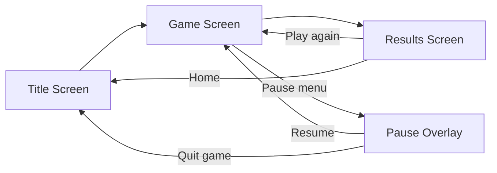

# Yahtzee with Oma — Design Specification

**Version:** 0.1 (single-player scope)
**Platform:** Mobile (iOS / Android), portrait orientation
**Engine:** Unity 2022.3 LTS

---

## 1. Concept

*Yahtzee with Oma* is a cozy, two-player Yahtzee game where the player faces a single AI opponent: **Oma**, a warm, playfully competitive grandmother character. The fantasy is sitting at Oma's kitchen table on a Sunday afternoon, rolling dice while she teases you, celebrates your good rolls, and quietly crushes you at the game she's played for fifty years.

This version covers **one game mode only**: a single local game of the player vs. Oma, standard Yahtzee rules, 13 rounds, highest total wins.

### Design pillars

1. **Cozy, not casino.** Warm palette, kitchen-table setting, soft sounds. No timers, no pressure, no ads in the play space.
2. **Oma is the product.** The rules are public domain; the reason to play is her personality. She should react to the game state constantly but never block or slow the player's input.
3. **One-thumb play.** Every interaction reachable and completable with one thumb in portrait. No gesture more complex than tap.
4. **Rules-faithful.** Standard Hasbro Yahtzee scoring, including the upper bonus and Yahtzee bonus / Joker rules, implemented exactly.
5. **You are at the table.** The game is a diegetic 3D scene — a first-person seat at Oma's kitchen table. The scorecard, dice, cup, and pencil are physical objects on the table, not UI panels floating over the world.

### Art direction (from concept art)

- **Style:** stylized low-poly 3D with soft/faceted shading; hand-crafted, warm, slightly nostalgic. No PBR realism.
- **Scene:** Oma's kitchen at night. Round wooden table under a single warm pendant lamp (the key light); cool blue night visible through curtained windows; wallpaper, hutch with plates and a family photo, hanging plant. The lamp pool on the table is where the game happens.
- **Set dressing on the table:** the game box, Oma's coffee/tea mug (tulip pattern), her upside-down scorecard and pencil on her side, the black dice cup, and the player's scorecard + pencil in the foreground.
- **Camera:** first-person seated view. Default framing shows Oma at top, dice mid-table, player's scorecard bottom — matching the portrait phone layout naturally. Camera treatments (gentle dolly/tilt) move focus between phases: dice close-up after a roll, scorecard emphasis when choosing a score, Oma when she reacts or takes her turn.
- **Oma in-scene:** a 3D low-poly character (grey bun, glasses, purple cardigan, hands folded on the table) replacing the 2D illustrated bust originally planned. Reaction poses/expressions from §2 apply to the 3D model (blend shapes or swap heads/poses — tech plan decides).

---

## 2. The Oma Character

- **Who she is:** The player's grandmother. Kind, a little cheeky, extremely good at Yahtzee. She never gloats meanly and never insults the player; her teasing is affectionate ("Ach, you're keeping *those*? Brave.").
- **Visual:** A stylized low-poly 3D character seated across the table (see Art direction, §1): grey bun, round glasses, purple cardigan, hands folded when idle. 4–6 poses/expressions minimum: neutral, thinking, happy, disappointed/mock-outraged, excited (Yahtzee), end-of-game.
- **Voice:** Text-only speech bubbles in v1 (audio barks are a stretch goal). Short lines, max ~90 characters, so they read in a glance. Her dialogue is sprinkled with German interjections and endearments as flavor ("Schatz", "Ach du lieber!", "na gut", "wunderbar!") — always in contexts where meaning is obvious from tone, never load-bearing for understanding the game.
- **Reaction triggers (v1 set):**
  - Game start greeting
  - Player rolls a Yahtzee / large straight (impressed)
  - Player scores a zero (sympathetic tease)
  - Oma rolls well (delighted) or scores a zero (mock despair)
  - Oma takes the lead / loses the lead
  - Upper bonus secured (either player)
  - Final round warning, and win/lose/tie endings
- Each trigger has **3+ line variants** chosen at random; no line repeats within a game if avoidable.
- Speech bubbles auto-dismiss after ~3.5 s and never block input; a new trigger replaces the current bubble.

---

## 3. Game Rules (authoritative)

A game is **13 rounds**. Each round, the player takes a turn, then Oma takes a turn. Each turn:

1. **Roll 1:** All five dice are rolled automatically (or on tap of the Roll button).
2. **Keep / re-roll:** The player may tap dice to mark them as *keepers*. Tapping a keeper releases it back. Up to **two re-rolls** of any non-kept dice are allowed. Keeper choices are freely revisable between rolls — a die kept after roll 1 may be released and re-rolled on roll 3.
3. **Score:** The turn ends when the player selects exactly one **open** category on their scorecard. The score is computed from the current five dice and locked in permanently. Scoring may happen after roll 1, 2, or 3 (the player may stop rolling early). A category, once used, can never be changed or reused — including categories scored as zero.

### 3.1 Scorecard

**Upper section** — score is the sum of dice showing the category's number only:

| Category | Score |
|---|---|
| Aces (Ones) | sum of 1s |
| Twos | sum of 2s |
| Threes | sum of 3s |
| Fours | sum of 4s |
| Fives | sum of 5s |
| Sixes | sum of 6s |

**Upper bonus:** if the six upper categories total **≥ 63**, add **35 points**. The bonus is displayed as a live progress element during play (see §5.3) and included in the final total.

**Lower section:**

| Category | Requirement | Score |
|---|---|---|
| 3 of a Kind | ≥ 3 dice equal | sum of all 5 dice |
| 4 of a Kind | ≥ 4 dice equal | sum of all 5 dice |
| Full House | 3 of a kind + a pair | 25 |
| Small Straight | 4 sequential dice (1-2-3-4, 2-3-4-5, 3-4-5-6) | 30 |
| Large Straight | 5 sequential dice (1-2-3-4-5, 2-3-4-5-6) | 40 |
| Yahtzee | all 5 dice equal | 50 |
| Chance | any dice | sum of all 5 dice |

Edge rulings: five of a kind qualifies as a Full House-scoring hand **only via the Joker rule** (see below), not on its own; five sequential dice do qualify for Small Straight; a category whose requirement isn't met may still be selected and scores **0**.

### 3.2 Yahtzee bonus & Joker rule

When a player rolls a Yahtzee (five of a kind) and their Yahtzee box is **already filled**:

- **Yahtzee box holds 50:** the player earns a **+100 bonus** (tracked as bonus checkmarks; a player can earn multiple across a game) and must still score the roll in another box, per the Joker rules below.
- **Yahtzee box holds 0:** no bonus, but the Joker rules below still apply for placement.

**Joker placement rules** (forced priority order):

1. If the matching **upper section** box (e.g., the Fours box for a Yahtzee of 4s) is open, the roll **must** be scored there (sum of dice).
2. Otherwise, the roll may be scored in **any open lower section** box at that box's full value: Full House = 25, Small Straight = 30, Large Straight = 40, 3/4 of a Kind and Chance = sum of dice.
3. If all lower boxes are also filled, the player must take a **0** in an open upper box of their choice.

The UI must enforce this: when a Joker situation is active, only legal boxes are selectable, and an explainer line ("Joker rules! You must…") is shown.

### 3.3 Game end

After 13 rounds both scorecards are full. Final total = upper subtotal + upper bonus + lower subtotal + (100 × Yahtzee bonus count). Highest total wins; equal totals are a tie. Oma delivers a closing line for each outcome, and a results screen shows both full scorecards side by side.

---

## 4. Oma as an opponent (gameplay behavior)

- Oma's turns run **automatically** with visible, watchable pacing: she rolls, her keepers highlight, she "thinks" (0.5–1.2 s beats), re-rolls, then her chosen scorecard cell flashes and fills in. A full Oma turn should take **6–12 seconds**.
- A **"Skip"** tap anywhere during Oma's turn fast-forwards her turn to its result instantly (same decisions, no animation). Her decisions are computed up front, so skipping never changes outcomes.
- **Skill level (v1):** one fixed difficulty — "solid club player." She plays a strong heuristic strategy (see tech plan §5.6) but is not a perfect optimal solver; target average score ~200–230. Difficulty settings are out of scope for v1.
- Oma **must follow identical rules** to the player, including Joker enforcement. Her dice rolls come from the same RNG; she never cheats in either direction.

---

## 5. Screens & UX

### 5.1 Screen map

- **Title:** logo, "Play" button, mute toggle, (later: settings/how-to-play). If a saved in-progress game exists: "Continue" and "New Game."
- **Pause overlay:** Resume, Restart, How to Play (static rules card), Sound toggle, Quit to title. Opened via a small pause icon; the game state freezes.
- **Results:** winner banner + Oma's closing reaction, both scorecards, total comparison, "Play Again" / "Home."

### 5.2 Game screen layout (portrait, diegetic 3D scene)

The screen is a first-person camera into the kitchen scene; the natural composition maps to the phone's portrait zones (per concept art):

1. **Oma zone (top ~third):** Oma seated across the table under the lamp, speech bubble beside her head, a small non-diegetic strip with her name + running total.
2. **Table / dice zone (middle):** the lamp-lit table center where dice land after leaving the cup. Kept dice slide toward the player's edge into a subtly highlighted "keep row"; unkept dice stay mid-table. Tap a die to toggle keep/release.
3. **Scorecard zone (bottom ~third):** the player's paper scorecard lying on the table in the foreground, angled toward the camera and legible. It is the interactive scorecard (ghost scores, tap-to-select, confirm) rendered as an in-world object. During Oma's turn the camera shifts so her card (or a readable overlay of it) is visible; the player can tap either card to peek at any time.
4. **Action bar (bottom edge, non-diegetic):** the **Roll button** with remaining-roll pips ("Roll ●●○") and turn status text ("Roll 2 of 3", "Choose a score", "Oma's turn…"). This and the pause icon are the only floating UI elements.

**Camera treatments:** short, gentle camera moves punctuate phases — push in over the dice when they settle (readability beats spectacle: dice values must be instantly legible, with a top-down-ish read angle), ease down/forward toward the scorecard during score selection, look up at Oma for her reactions and turn. All moves ≤ 0.6 s, skippable by acting immediately; motion kept subtle to avoid motion discomfort.

**Prototype note:** the first playable uses a flat 2D layout with the same four zones (see tech plan §5.4); the diegetic scene replaces it once the loop is proven.

### 5.3 Scorecard interaction

- During the player's turn, after every roll, each **open** cell shows its **potential score** for the current dice in a muted "ghost" style; filled cells show their locked score in solid ink.
- Tapping an open cell selects it → cell highlights and a **Confirm checkmark** appears on/near the cell. Second tap (confirm) locks it in. This two-step prevents mis-taps from permanently scoring; there is **no undo** after confirm.
- Cells that would score 0 are still selectable (marked "0") — sometimes sacrificing a category is correct.
- The upper section shows a **bonus progress** line: "Bonus: 41 / 63" with a subtle bar; turns gold with "+35" when secured.
- Yahtzee bonus checkmarks appear as small chips next to the Yahtzee cell (each worth 100).

### 5.4 Feedback & juice (v1 scope)

- **Dice rolls are physical:** dice pour from the black cup and tumble onto the table with 3D physics (final build; the 2D prototype fakes this with tweens). Roll resolution ≤ ~1.2 s from tap to readable rest; results always legible at rest, with the camera push-in from §5.2 guaranteeing readability.
- Score lock-in: brief count-up on the cell and the running total.
- Special-hand fanfare: distinct short effects for Yahtzee (big), large straight / full house (medium), upper bonus secured (medium).
- Sound: dice rattle/land, cell tap, score lock, fanfare stingers, one soft background loop. Global mute toggle.
- Haptics: light tap on keep/release, medium on score lock, success pattern on Yahtzee (respect OS settings).

### 5.5 Accessibility & mobile basics

- Minimum touch target 64 px @ 1080-width reference; dice pips high-contrast; never color-only signaling (keepers get position + outline, not just tint).
- Text via TextMeshPro, legible at arm's length; support common notch/safe-area insets.
- Interruptions: app pause/kill mid-game must not lose state (auto-save every state change; "Continue" on title screen).
- Offline-only; no network required, no accounts, no analytics in v1.

---

## 6. Out of scope for v1 (explicitly)

- Multiplayer (local or online), more than one AI opponent, difficulty selection
- Oma voice audio; full-body character animation beyond the §2 pose/expression set (no lip sync, no walking around)
- Meta-progression, stats history, achievements, unlockables
- Monetization, ads, IAP
- Tablet/landscape layouts, localization (English only, with German flavor phrases per §2)

---

## 7. Resolved design decisions

1. **German flavor phrases: yes.** Oma's dialogue freely uses German interjections/endearments as personality flavor (§2). English remains the game's only supported language; German lines must never carry rules-critical information.
2. **Dice: 2D prototype → 3D physics for the real game.** The first playable proves the loop with 2D sprite dice; the shipping game rolls physical 3D dice from the cup with camera treatments for readability (§5.2, §5.4; tech plan §5.4).
3. **Mid-game restart has no consequence.** No stats, no loss recorded — it's a cozy game. Restart simply starts fresh (Oma may get one gentle teasing line about it).
