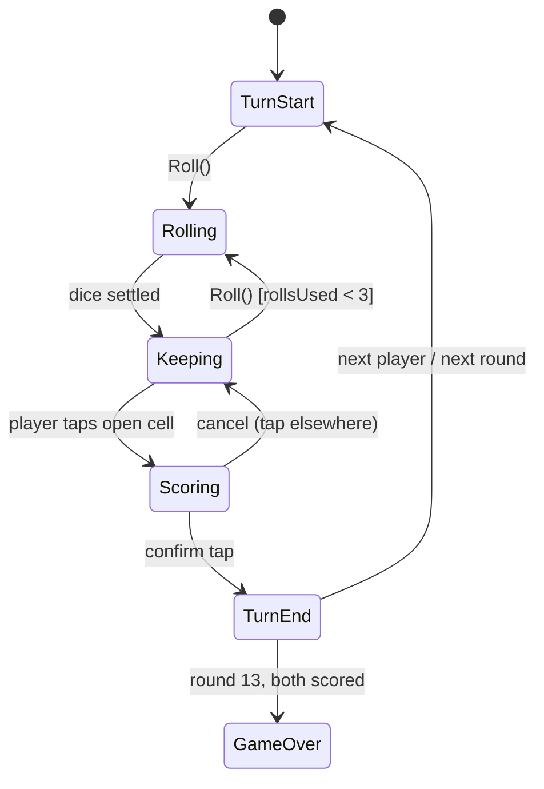

# Yahtzee with Oma — Technical Implementation Plan

**Companion to:** [DESIGN_SPEC.md](DESIGN_SPEC.md)
**Engine:** Unity 2022.3.62f3 LTS (existing project, Mobile 3D template)
**UI stack:** uGUI + TextMeshPro (already in manifest)
**Targets:** Android (API 24+), iOS (14+), portrait-only

---

## 1. Guiding architecture decision

**Separate pure-C# game core from Unity presentation.** All rules, scoring, turn flow, and AI live in plain C# classes with no `UnityEngine` dependencies (except math structs if convenient). MonoBehaviours only render state and forward input.

Why: Yahtzee logic (especially Joker rules and the AI) is exactly the kind of code that breaks subtly; a pure core makes it fully unit-testable in EditMode without scenes, makes the AI simulate turns cheaply, and makes save/load trivial (serialize one state object).

```
Assets/
  Scripts/
    Core/            (asmdef: Yahtzee.Core — no UnityEngine refs)
      Dice/          DiceState, IRandomSource
      Scoring/       Category enum, ScoreCalculator, Scorecard, JokerRules
      Game/          GameState, TurnState, GameEngine, GameEvent
      AI/            OmaAI (decision-making only)
    Presentation/    (asmdef: Yahtzee.Presentation — refs Core)
      GameController.cs        (drives engine, owns pacing)
      CameraDirector.cs        (phase framings / camera treatments, §5.5)
      IDiceView + DiceView2D (prototype) / DiceView3D (physics, §5.4)
      ScorecardView / ScoreCellView
      OmaView / SpeechBubbleController
      HudView (roll button, status, totals)
      Screens/ (Title, Results, PauseOverlay)
    Services/        SaveService, AudioService, HapticsService, DialogueService
  Tests/
    EditMode/        (asmdef refs Yahtzee.Core) — scoring, joker, engine, AI tests
  Data/              ScriptableObjects: OmaDialogueSet, AudioLibrary, GameConfig
  Art/  Audio/  Prefabs/  Scenes/
```

Single scene (`Game.unity`) with screen roots toggled by a lightweight screen manager is sufficient at this size; Title/Results/Pause are canvases, not separate scenes.

---

## 2. Core domain model

All types below are plain C#, serializable.

- **`Category`** — enum of the 13 boxes (Aces…Sixes, ThreeOfAKind…Chance).
- **`DiceState`** — five die values (1–6) + five `isKept` flags + `rollsUsed` (0–3).
- **`ScoreCalculator`** — *stateless static* functions: `Score(Category, int[] dice)`, plus helpers (`IsFullHouse`, `HasStraight(n)`, counts histogram). Pure functions of the five dice; no scorecard knowledge.
- **`Scorecard`** — 13 nullable slots, `yahtzeeBonusCount`, computed `UpperSubtotal`, `HasUpperBonus` (≥63 → +35), `Total`.
- **`JokerRules`** — given (dice, scorecard) where dice are a Yahtzee and the Yahtzee box is filled, returns: whether the +100 bonus applies (box holds 50), and the **set of legal categories** in forced priority order (matching upper box → any open lower → any open upper at 0). Also defines the Joker score for each legal box (fixed values for FH/SS/LS even when dice don't literally qualify).
- **`GameState`** — two `Scorecard`s (player, Oma), current round (1–13), whose turn, current `TurnState`, RNG seed/state. This one object is the save file.
- **`GameEngine`** — the only mutator. API surface:
  - `StartGame(seed)`
  - `Roll()` (validates rolls remaining)
  - `SetKeep(dieIndex, bool)`
  - `GetLegalCategories()` → open boxes, or Joker-restricted set
  - `GetPotentialScores()` → per open box, for scorecard ghosting
  - `ScoreCategory(Category)` → locks score, applies Yahtzee bonus, advances turn/round, detects game end
  - Emits **`GameEvent`s** (DiceRolled, ScoreCommitted, JokerActivated, BonusSecured, TurnChanged, GameEnded…) consumed by the presentation layer and the dialogue trigger system. Events are the *only* channel from core to presentation.
- **`IRandomSource`** — injected RNG (`System.Random` wrapper in production, scripted sequences in tests). Oma and player draw from the same source.

### State machine



The engine enforces legality (can't roll with 0 remaining, can't score a filled box, Joker restrictions); the UI merely greys out illegal actions. Engine methods throw/return failure on illegal calls so bugs surface loudly in tests.

---

## 3. Presentation layer

- **`GameController`** (MonoBehaviour): owns the `GameEngine`, subscribes to its events, and sequences presentation with coroutines/async — dice animation, score count-ups, Oma's turn pacing. It is the *only* class that calls engine mutators.
- **Player input flow:** DieView tap → `SetKeep`; Roll button → `Roll()`; ScoreCellView tap → selection state in controller; second tap → `ScoreCategory`. Input is locked during animations and during Oma's turn (except the Skip tap).
- **Oma's turn:** controller asks `OmaAI` for the *entire* turn plan up front? No — decisions depend on roll outcomes, so it's staged: `OmaAI.DecideKeepers(state)` after each roll and `OmaAI.DecideCategory(state)` at the end. The controller inserts think-delays between stages and plays keep-highlight animations. **Skip** sets a `fastForward` flag: remaining stages execute immediately with animations skipped; decisions are deterministic given the state so skipping can't change results.
- **Scorecard ghosting:** on every `DiceRolled`/keep change during the player's turn, controller pulls `GetPotentialScores()` and pushes to `ScorecardView`.
- **Dialogue:** `DialogueService` subscribes to the same engine events, maps them to trigger types, picks an unused variant from the `OmaDialogueSet` ScriptableObject (per-game used-lines set), and drives `SpeechBubbleController`. Dialogue is fire-and-forget and never gates game flow.

---

## 4. Services

- **SaveService:** serialize `GameState` to JSON via `JsonUtility` (or Newtonsoft if nullable slots fight `JsonUtility` — decide in M1; a 13-element int array with -1 sentinel sidesteps it) at `Application.persistentDataPath/save.json`. Write on every `ScoreCommitted`/`TurnChanged` and on `OnApplicationPause`. Title screen offers Continue if a valid, unfinished save exists. Include a save-format version int from day one.
- **AudioService:** one SFX `AudioSource` pool + one music source; `AudioLibrary` ScriptableObject maps event → clip(s). Mute persisted in `PlayerPrefs`.
- **HapticsService:** `Handheld.Vibrate` fallback; use light wrapper so we can drop in a proper haptics plugin (e.g., Nice Vibrations or per-platform APIs) later without touching call sites.

---

## 5. Key implementation topics

### 5.1 Scoring correctness

`ScoreCalculator` is table-driven off a value histogram (`counts[1..6]`). Straight detection via bitmask of present values (small straight = any of `0b001111`, `0b011110`, `0b111100` submasks). All category functions covered by exhaustive unit tests (see §7).

### 5.2 Joker rules

Most bug-prone area. Implementation notes:

- Detect Joker condition in `GameEngine.Roll`-settled state: dice are five-of-a-kind AND Yahtzee box filled.
- Bonus (+100) applies **only** if the Yahtzee box holds 50, and applies **when the roll is scored** (once per qualifying turn), regardless of which box it lands in.
- `GetLegalCategories()` returns the restricted set; `GetPotentialScores()` returns Joker values (FH 25 / SS 30 / LS 40 even though dice don't literally qualify).
- Emit `JokerActivated` so the UI can show the explainer and restrict cells.

### 5.3 Determinism & RNG

Single `System.Random` seeded per game, seed stored in `GameState`. Dice results are drawn by the engine, never by presentation. This gives: replayable bugs (log seed), honest AI (same stream), and testable sequences via `IRandomSource`.

### 5.4 Dice: 2D prototype, 3D physics for ship (decided)

Per design spec §7: prototype with **2D sprite dice + tweened roll animation** to prove the loop fast, then replace with **3D physics dice** poured from the cup in the diegetic scene. Both live behind the same `IDiceView` interface driven by engine events, so the swap touches only presentation.

Key constraint for the 3D implementation: **the engine decides values; physics is theater.** Do *not* read values off settled rigidbodies — that path invites cocked dice, mis-reads, and (worst) results that disagree with `GameState`. Instead:

- Engine rolls first → target faces known before the animation starts.
- Dice are launched from the cup with randomized physics impulses; as each die loses energy past a threshold, it is guided (torque steering or a short slerp blend during the last tumble) so its final resting face matches the engine value. This is the standard "deterministic dice" technique; done in the last ~0.3 s it is imperceptible.
- Safety net: watchdog timer (~2.5 s) hard-snaps any die that hasn't settled (off-table, cocked against the box) to a valid pose at the engine value.
- Kept dice are kinematic and animate (tween) to the keep row; only unkept dice re-enter the physics roll.
- Physics settings: fixed timestep fine at default 0.02; five dice + table colliders is trivial for mobile. Table gets a low-bounce physic material; an invisible collider "fence" keeps dice inside the playable oval.

### 5.5 Scene, camera & interaction (3D phase)

- **Scene:** one static kitchen environment (low-poly, single warm point/spot light for the lamp + low ambient; baked or simple realtime — profile on device, likely fine realtime at this poly count). Set dressing (box, mug, cup, Oma's card) is static decoration except the cup, which animates during rolls.
- **Camera rig:** one Cinemachine setup (or a simple custom rig — decide at M4 start; Cinemachine is in-box for 2022.3 and recommended) with virtual cameras / framing presets per phase: **Default**, **DiceFocus** (post-roll push-in, high-angle for legibility), **ScorecardFocus**, **OmaFocus**. Blends ≤ 0.6 s; any player input during a blend snaps to the interactive framing. Portrait FOV tuned so the default framing matches the concept art (Oma top, dice middle, card bottom).
- **Diegetic scorecard:** the player's scorecard is a world-space canvas (or quad with a RenderTexture) lying on the table, angled toward the camera. Cells are the same `ScoreCellView` prefabs as the 2D prototype re-parented into world space — interaction logic unchanged.
- **Input:** taps ray-cast against dice colliders and the scorecard's world-space canvas (`GraphicRaycaster` + `TrackedDeviceRaycaster` not needed — standard camera ray). Roll button/status remain screen-space overlay.
- **Oma model:** low-poly rigged character, small pose/expression set (design §2). Simplest robust approach: a handful of idle/reaction animation clips + expression handled by material/UV swap on the face or blend shapes — decide with the artist at M5; the `OmaView` API (`SetPose`, `PlayReaction`) stays identical either way.

### 5.6 Oma AI (v1 heuristic)

Target strength: ~200–230 average (design §4). A clean, testable heuristic — **not** the full optimal-play state-value table (that's a known solved problem but overkill and would make her too strong anyway).

- **Category choice (end of turn):** score each legal box with `value = immediateScore + weightAdjustments`, where adjustments encode: upper-bonus progress (value upper scores that keep the ≥63 pace, roughly 3×count of the face), penalty for burning Yahtzee/high-value boxes cheaply, preference to dump zeros into Aces/Twos late. Pick max.
- **Keeper choice (rolls 1–2):** enumerate the 32 keep-subsets of the current dice; for each, estimate expected best final score by a small closed-form/heuristic evaluation (pair/triple retention values, straight-draw counts, upper-bonus pace) rather than full expectimax. Pick the best subset. This is ~32 cheap evaluations, instant on mobile.
- Tuning knob: a single "sloppiness" ε (choose 2nd-best option with small probability) reserved for future difficulty levels; set to 0 or near-0 in v1 and tuned against the target average via simulation (§7).
- AI must call the same `GetLegalCategories()` — Joker compliance for free.

### 5.7 Mobile config

- Portrait lock, target 60 fps (`Application.targetFrameRate = 60`), single canvas with reference resolution 1080×2340, safe-area handler component on the root layout.
- Android: IL2CPP + ARM64 (Play requirement); iOS: standard IL2CPP. Strip the template's unused modules later (terrain, vehicles, XR, etc.) — cleanup task, not urgent.
- Remove `Assets/TutorialInfo` and rename `SampleScene` → `Game` in M1.

---

## 6. Testing strategy

Unity Test Framework (already in manifest), EditMode tests against `Yahtzee.Core`:

1. **ScoreCalculator:** table of (dice, category, expected) covering every category, all straights, full-house edge cases (five-of-a-kind is NOT a natural full house), zero cases.
2. **Scorecard:** upper bonus at 62/63/64; totals with multiple Yahtzee bonuses.
3. **JokerRules:** every branch — bonus vs. no-bonus (Yahtzee box 50 vs. 0), forced upper box, lower-as-wildcard values, all-lower-filled → forced upper zero.
4. **GameEngine:** scripted-RNG full turns; illegal-action rejection (roll #4, score filled box, ignore Joker restriction); 13-round game completes with correct totals; save → load → identical state.
5. **OmaAI simulation harness:** an EditMode test/menu tool that runs N=10,000 self-play games, asserts no illegal action ever, and reports score distribution (mean, p10/p90) to tune toward the 200–230 target.
6. **Presentation:** manual test checklist per milestone (device rotation lock, interruption/resume, skip-during-Oma, mis-tap protection). No automated UI tests in v1.

---

## 7. Milestones

| # | Milestone | Contents | Exit criteria |
|---|---|---|---|
| M1 | **Core rules engine** | Project cleanup, asmdefs, Core domain model, ScoreCalculator, Scorecard, JokerRules, GameEngine, SaveService (headless), full EditMode test suite | All §6.1–6.4 tests green; a scripted 13-round game runs headless with correct totals |
| M2 | **Playable prototype loop (2D)** | Flat 2D game screen, sprite dice/keep UI, scorecard with ghost scores + confirm flow, roll button, HUD; player plays *both* sides manually | Full game playable on device build; save/continue works |
| M3 | **Oma plays** | OmaAI, Oma turn pacing + skip, scorecard peeking, simulation harness + tuning (still in 2D prototype) | Oma completes games legally at target strength; her turns read clearly and skip works |
| M4 | **The kitchen (3D scene)** | Kitchen environment, camera rig + phase framings, 3D physics dice with deterministic guidance + cup pour, diegetic world-space scorecard; replaces 2D layout | Full loop playable in the 3D scene on device at 60 fps; dice always settle on engine values; card legible on small screens |
| M5 | **Oma lives** | Oma 3D model integration, poses/reactions, DialogueService + full v1 trigger/line set (incl. German flavor), speech bubbles | All design-spec triggers fire with variants; no dialogue ever blocks input |
| M6 | **Polish & ship-ready** | Title/Results/Pause screens, audio, haptics, fanfares, camera-motion comfort pass, safe-area/device pass, icon/splash, perf check | Design-spec §5.4–5.5 met; clean builds on both platforms; manual checklist passes |

Each milestone is independently demoable; M1 has no visual component by design. The 2D prototype layer (M2–M3) is scaffolding: keep it behind the same view interfaces so M4 is a swap, not a rewrite, and keep it available via a debug flag for fast rules testing even after M4.

---

## 8. Risks

| Risk | Impact | Mitigation |
|---|---|---|
| Joker-rule edge cases wrong | Rules-faithfulness pillar broken | Isolated `JokerRules` class, exhaustive tests written *before* UI (M1) |
| Oma too strong/weak | Game feels unfair or boring | Simulation harness with score-distribution report; tune ε/weights against target band |
| 3D dice show wrong faces / never settle | Result disagrees with scorecard — worst possible bug | Engine-first values with guided settling (§5.4); watchdog snap; automated soak test rolling 1,000 times comparing rest face to engine value |
| Diegetic scorecard illegible on small phones | Core interaction unusable | ScorecardFocus camera framing sized for smallest supported screen; test on a 5.5" device at M4, fall back to a larger card angle if needed |
| Camera motion discomfort | Players feel queasy in a cozy game | Short (≤0.6 s), eased, mostly-translational moves; comfort pass in M6; consider a "reduce motion" toggle |
| `JsonUtility` limitations (nullables, dictionaries) | Save bugs | Save-format decided and round-trip-tested in M1 while the model is small |
| Dialogue spam annoying | Undermines the Oma pillar | Per-game no-repeat set, auto-dismiss, replace-don't-queue policy from day one |
| "Yahtzee" trademark (Hasbro) | Store rejection / legal | Flag for pre-release review: may need a rename (e.g., "Dice with Oma") and original scorecard wording; no Hasbro assets anywhere |
